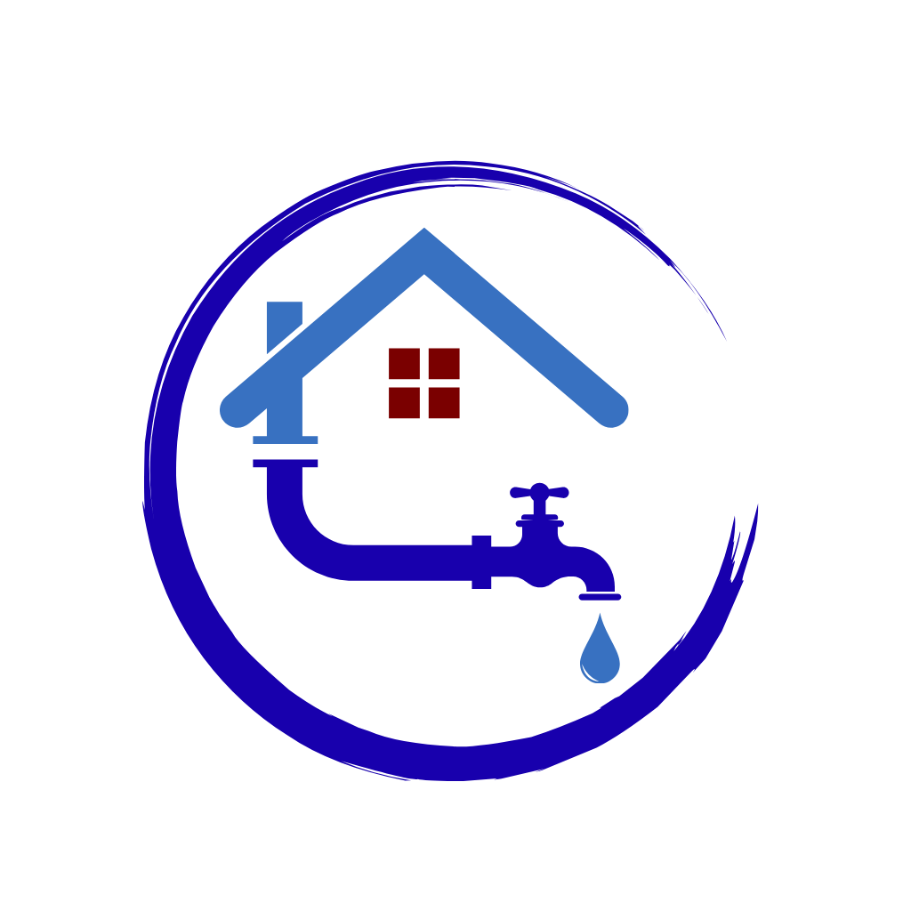

<div align="center">



# 💧 AquaBytes

### Universal Rainwater Harvesting Portal

**Check feasibility • Explore analytics • Monitor projects**

[](https://aquabytes.netlify.app/)
[](https://www.youtube.com/watch?v=g-DGNQVrjl8)
[](https://www.sih.gov.in/)
[-blue?style=for-the-badge)](https://jalshakti-dowr.gov.in/)

<br/>

> **Problem Statement by:** Ministry of Jal Shakti (MoJS) · Central Ground Water Board (CGWB)  
> **Category:** Software · **Theme:** Smart Automation

</div>

---

## 📌 Overview

AquaBytes is a **SIH-selected** full-stack web & mobile application that empowers citizens and communities to assess **Rooftop Rainwater Harvesting (RTRWH)** and **Artificial Recharge (AR)** potential — right from their smartphone or browser.

By entering simple inputs like location, roof area, population, and budget, users get personalized, GIS-powered feasibility reports with dimensions for recharge structures, cost estimates, and real-time water risk intelligence.

The platform pairs a **live IoT sensor network** (ESP32-based) with **ML-driven water quality analysis** to give users an end-to-end picture of their water situation — from the sky to the tank.

---

## 📸 Screenshots

<div align="center">

| Home Screen | Feasibility Results |
|:-----------:|:-------------------:|
|  |  |

| Water Quality / WQI | Water Hub (Risk Intelligence) |
|:-------------------:|:-----------------------------:|
|  |  |

| App in Action | Possitive Response as Result |
|:-------------:|:--------------------:|
|  | .jpeg>) |

</div>

---

## 🎯 Problem Statement

> Designing and development of an application for on-spot assessment of Rooftop Rainwater Harvesting (RTRWH) and Artificial Recharge potential and size of the RTRWH and AR structures.

Despite CGWB publishing detailed manuals on RTRWH, **no user-friendly digital platform** existed for individuals to directly assess their harvesting potential. AquaBytes fills that gap.

---

## ✨ Key Features

### 🏗️ Feasibility Calculator
Enter your **location, roof area, number of dwellers, available open space, and budget** to get:
- Estimated rainwater collection volume
- Recommended RTRWH / Artificial Recharge structure type
- Dimensions of recharge pits, trenches, and shafts
- Cost estimation and cost-benefit analysis
- Principal aquifer information for the area
- Depth to groundwater level
- Local rainfall & runoff data

### 💡 Water Hub — Smart Water Risk Intelligence
Tells you **how efficiently to use your stored water** based on upcoming rain:
- Current tank level and capacity
- Household consumption vs. need
- 7-day rainfall forecast (live weather API)
- Real-time sensor data (pH, TDS)
- ML-predicted water risk score & actionable recommendations

### 🔬 Water Quality Check (Live Sensor + Manual)
Analyze water quality via **live IoT sensor feed or manual input**:
- pH, TDS, Turbidity, Temperature, Dissolved Oxygen
- **Water Quality Index (WQI)** calculation with safety category
- Microbial risk classification (ML model)
- Heavy metal risk classification (ML model)
- Irrigation suitability verdict
- Historical readings and alert management

### ⚠️ Risk Predictor
Uses sensor history and system data to predict:
- Maintenance risk level
- Contamination probability
- Water scarcity forecast

### 🤖 Elsa — AI Chatbot
Powered by **Google Gemini**, Elsa is a domain-specific assistant:
- Answers questions about water harvesting, recharge, and feasibility
- Remembers your latest survey for personalized advice
- Responds in the **user's native language** automatically

### 📊 Analytics Dashboard (Web)
- Regional rainfall trends with interactive charts
- India groundwater map with district-level data
- Historical water quality trends per device

### 🗺️ Resources & Downloads (Web)
- CGWB manuals and scientific reports
- Practical guides on RTRWH
- Web tools: Feasibility Calculator, Risk Predictor, Water Quality Check

---

## 🌐 Multi-Language Support

AquaBytes supports **23 Indian languages** out of the box, ensuring accessibility across the country:

`English` `Hindi` `Bengali` `Assamese` `Gujarati` `Kannada` `Kashmiri` `Konkani`  
`Maithili` `Malayalam` `Manipuri` `Marathi` `Nepali` `Odia` `Punjabi` `Sanskrit`  
`Santali` `Sindhi` `Tamil` `Telugu` `Urdu` `Bodo` `Dogri`

---

## 🔌 IoT Integration — Live Sensor Hardware

The ESP32-based sensor node measures water quality directly from the harvested tank and pushes data to the cloud in real time.

| Sensor | Parameter | Pin |
|--------|-----------|-----|
| Analog pH Probe | pH (0–14) | GPIO 34 |
| TDS Sensor | Total Dissolved Solids (ppm) | GPIO 35 |
| Turbidity Sensor | Turbidity (NTU) | GPIO 32 |
| (Configured) | Dissolved Oxygen | — |

**Data flow:** `ESP32 → Wi-Fi → FastAPI Backend → ML Prediction → Mobile / Web App`

---

## 🏗️ Architecture

```
AquaBytes
├── 📱 Mobile App (React Native / Expo Router)
│   ├── Feasibility Assessment
│   ├── Water Quality Monitor (Live + Manual)
│   ├── Water Hub (Risk Intelligence)
│   ├── History & Alerts
│   └── Elsa AI Chatbot (Gemini)
│
├── 🌐 Website (HTML/CSS/JS)
│   ├── Landing Page & Info
│   ├── Feasibility Calculator Tool
│   ├── Water Quality Check Tool
│   ├── Risk Predictor Tool
│   ├── Analytics Dashboard (Charts + Map)
│   └── Resources & Downloads
│
├── ⚙️ Backend (FastAPI / Python)
│   ├── /api/v1/rtwh/feasibility        → RTRWH feasibility engine
│   ├── /api/v1/water-quality/predict    → ML water quality analysis
│   ├── /api/v1/water-risk/{device}      → Smart water hub risk
│   ├── /api/v1/devices/{id}/history     → Sensor history
│   ├── /api/v1/geocode                  → GIS location lookup
│   └── /api/v1/alerts                   → Alert management
│
└── 🔌 IoT Firmware (ESP32 / Arduino)
    └── pH + TDS + Turbidity → Wi-Fi → Cloud API
```

---

## 🧠 Machine Learning Models

| Model | Type | Purpose |
|-------|------|---------|
| `heavy_metal_rf.joblib` | Random Forest | Heavy metal contamination risk |
| `microbial_rf.joblib` | Random Forest | Microbial contamination risk |
| WQI Calculator | Algorithmic | Water Quality Index scoring |
| Water Risk Model | Regression + Rules | Tank water sufficiency & risk |
| Rainfall Budget Model | ML + Weather API | Water budget forecasting |

Training datasets: `rainfall.csv`, `synthetic_training.csv`, `water_dataX.csv`

---

## 🛠️ Tech Stack

| Layer | Technologies |
|-------|-------------|
| **Mobile App** | React Native, Expo Router, i18next, Gemini AI, react-native-chart-kit |
| **Website** | HTML5, CSS3, Vanilla JS, Chart.js, Leaflet Maps |
| **Backend** | FastAPI, Python, Pydantic, Uvicorn |
| **ML / AI** | scikit-learn, NumPy, Pandas, joblib, Google Generative AI |
| **IoT Firmware** | Arduino C++ (ESP32), Wi-Fi, HTTPClient |
| **Geo / Weather** | GeoPy, Open-Meteo / weather API |
| **Deployment** | Netlify (web), Render (backend), Expo (mobile) |

---

## 🚀 Getting Started

### Prerequisites
- Python 3.10+
- Node.js 18+
- Expo CLI (`npm install -g expo-cli`)
- *(Optional)* Arduino IDE for IoT firmware

---

### 1. Backend

```bash
cd src/backend
pip install -r requirements.txt
uvicorn main:app --reload
```

API: `http://localhost:8000` · Swagger docs: `http://localhost:8000/docs`

---

### 2. Mobile App

```bash
cd src/frontend/android_app
npm install
npx expo start
```

Scan the QR code with **Expo Go** (Android / iOS) or run on an emulator.

---

### 3. Website

Open `src/frontend/website/index.html` directly in a browser, or serve statically:

```bash
npx serve src/frontend/website
```

---

### 4. IoT Firmware

1. Open `IOT/EVS_Project.ino` in **Arduino IDE**
2. Set your Wi-Fi credentials (`ssid`, `password`) and point `apiURL` to your backend
3. Flash to your **ESP32** board
4. The device will begin streaming sensor readings to the backend automatically

---

## 📂 Project Structure

```
AquaBytes/
├── IOT/
│   └── EVS_Project.ino           # ESP32 sensor firmware
├── src/
│   ├── backend/
│   │   ├── main.py               # FastAPI entry point
│   │   ├── requirements.txt
│   │   ├── database.json         # Lightweight local store
│   │   ├── app/
│   │   │   ├── models.py         # Pydantic data models
│   │   │   └── routes.py         # All API endpoints
│   │   ├── algo/
│   │   │   └── sim_rainwater.py  # RTRWH algorithm engine
│   │   ├── ml/
│   │   │   ├── predictor.py      # WQI + risk predictor
│   │   │   ├── water_budget_model.py
│   │   │   ├── datasets/         # Training CSVs
│   │   │   └── models/           # Trained .joblib models
│   │   └── utils/
│   │       ├── rainfall_engine.py
│   │       ├── weather.py        # Live weather forecast
│   │       └── location.py       # GIS geocoding
│   └── frontend/
│       ├── android_app/          # React Native / Expo app
│       │   ├── app/              # Expo Router screens
│       │   ├── components/       # Reusable UI components
│       │   ├── locales/          # 23 language JSON files
│       │   └── utils/            # Chatbot & helpers
│       ├── website/              # Static web portal
│       │   ├── index.html
│       │   ├── tools/            # Calculator, Quality, Risk tools
│       │   └── stat/             # Analytics (charts + map)
│       └── screenshots/          # App screenshots
└── README.md
```

---

## 🌍 Live Links

| Platform | URL |
|----------|-----|
| 🌐 Website | [aquabytes.netlify.app](https://aquabytes.netlify.app/) |
| ▶️ YouTube Demo | [youtube.com/watch?v=g-DGNQVrjl8](https://www.youtube.com/watch?v=g-DGNQVrjl8) |
| ⚙️ Backend API Docs | [evs-aquabytes.onrender.com/docs](https://evs-aquabytes.onrender.com/docs) |

---

## 🏆 Recognition

- ✅ **Selected** at **Smart India Hackathon (SIH)**
- 🏛️ **Organization:** Ministry of Jal Shakti (MoJS)
- 🔬 **Department:** Central Ground Water Board (CGWB)
- 📂 **Problem Category:** Software — Smart Automation

---

## 🤝 Contributing

Contributions are welcome! Please read [CODE_of_CONTACT.md](CODE_of_CONTACT.md) before submitting a pull request.

1. Fork the repository
2. Create your feature branch (`git checkout -b feature/AmazingFeature`)
3. Commit your changes (`git commit -m 'Add AmazingFeature'`)
4. Push to the branch (`git push origin feature/AmazingFeature`)
5. Open a Pull Request

---

## 📄 License

This project is licensed under the terms in the [LICENSE](LICENSE) file.

---

<div align="center">

**Built with ❤️ for India's groundwater future**

*AquaBytes — Empowering every citizen to conserve, harvest, and sustain water.*

[](https://aquabytes.netlify.app/)

</div>
